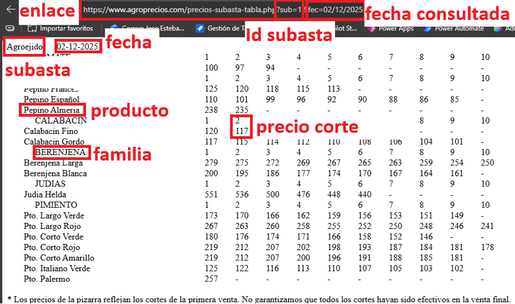

# Agroprecios Scrapper (Python)

## Resumen

Este módulo implementa un *scrapper* incremental para el endpoint PHP usado por Agroprecios para construir su tabla de subastas diarias. El objetivo es capturar y mantener un histórico estructurado de subastas, familias, productos y precios por corte, empleando archivos JSON como almacenamiento persistente.

---

## 1. Motivación y contexto técnico

En la interfaz pública de Agroprecios, la tabla de subasta se construye a partir del endpoint:

`https://www.agroprecios.com/precios-subasta-tabla.php?sub=<id>&fec=<dd/mm/yyyy>&op=1`

La evidencia de este mecanismo se observa en el propio HTML (evento `onclick` y llamada JavaScript con `cargar2(...)`), lo que habilita una estrategia de recuperación de datos de tipo servidor-servidor sin automatización de navegador.

### Figura 1. Endpoint PHP en la interfaz



### Figura 2. Fragmento HTML de referencia (`tab_pre_sub`)


---

## 2. Objetivo del scrapper

Construir y mantener un histórico de subastas con cuatro artefactos JSON:

- `subastas.json`: catálogo de subastas (ID y nombre).
- `familias.json`: catálogo de familias (ID y nombre).
- `productos.json`: catálogo de productos (ID, familia, nombre y URL).
- `preciosubasta.json`: hechos diarios de precio por corte.

El sistema debe permitir ejecuciones repetidas sobre rangos de fechas sin duplicar información ya almacenada.

---

## 3. Especificación funcional

El script principal es `agroprecios_scrapper.py` y acepta:

- `--lastdate=dd/mm/yyyy`: fecha más reciente a consultar.
- `--maxdays=<n>`: número de días hacia atrás (incluye `lastdate`).
- `--maxsubastas=<n>`: IDs de subasta desde `1` hasta `n`.

### Comportamiento por defecto

- `lastdate = hoy`
- `maxdays = 1`
- `maxsubastas = 10`

Por tanto, por defecto el volumen de consultas es:

`consultas = maxdays * maxsubastas = 1 * 10 = 10`

Esta configuración se alinea con un uso responsable y predecible del recurso remoto.

---

## 4. Metodología de extracción

Para cada combinación `(fecha, subasta_id)` en el rango solicitado:

1. Se realiza una petición GET al endpoint PHP.
2. Se detecta posible respuesta de error (`ERROR` sin tabla válida).
3. Se parsea el HTML con `BeautifulSoup`:
	- Nombre de subasta (`td.titNombreizq`).
	- Fecha mostrada en cabecera (`td.titNombreder`, formato `dd-mm-yyyy`).
	- Tabla de datos (`table.tab_pre_pro`).
	- Filas de familia (`tr.familias_subasta`) y filas de producto (`td.pro`, `td.txt`).
4. Se transforman cortes:
	- Valores numéricos a `int`.
	- Guiones `-` a `None` (se ignoran al persistir hechos).
5. Se actualiza almacenamiento local evitando duplicados.

La fecha persistida para precios es **la fecha mostrada por la página**, no solo la fecha solicitada, para mantener trazabilidad con la fuente.

---

## 5. Modelo de datos y reglas de unicidad

### 5.1 `subastas.json`

Campos:

- `id` (int)
- `nombre` (str)

Regla: si una subasta ya existe por ID, se actualiza el nombre si cambia.

### 5.2 `familias.json`

Campos:

- `id` (int autoincremental local)
- `nombre` (str)

Regla de unicidad: `nombre` normalizado en minúsculas.

### 5.3 `productos.json`

Campos:

- `id` (int autoincremental local)
- `familia_id` (int)
- `nombre` (str)
- `url` (str | null)

Regla de unicidad: `(familia_id, nombre_normalizado)`.

### 5.4 `preciosubasta.json`

Campos:

- `subasta_id` (int)
- `fecha` (str ISO, `yyyy-mm-dd`)
- `producto_id` (int)
- `corte` (int, desde 1)
- `precio` (int)

Regla de unicidad compuesta:

`(subasta_id, fecha, producto_id, corte)`

Si ya existe la combinación, se ignora (no se duplica).

---

## 6. Ética, robustez y límites operativos

### 6.1 Uso ético

- Se evita *crawling* masivo no acotado.
- El valor por defecto limita la carga a 10 peticiones por ejecución.
- La extracción se realiza sobre información públicamente expuesta por la aplicación web.

### 6.2 Elección de `maxsubastas`

El script **no** usa un bucle infinito para “descubrir” subastas automáticamente porque:

- añade complejidad innecesaria,
- puede provocar bloqueos ante cambios en el endpoint,
- y fuerza consultas adicionales sin valor práctico cuando el número de subastas es estable.

Por diseño, `maxsubastas` es configurable y explícito.

### 6.3 Manejo de errores

- Errores de red/HTTP se registran como `WARN` y el proceso continúa.
- Respuestas no válidas se registran como `INFO`.
- Se imprime resumen final con consultas ejecutadas e inserciones nuevas.

---

## 7. Reproducibilidad experimental

### Requisitos

```bash
pip install -r requirements.txt
```

Dependencias:

- `requests`
- `beautifulsoup4`

### Ejecuciones de referencia

```bash
# Ejecución mínima (1 consulta)
python agroprecios_scrapper.py --maxsubastas=1 --maxdays=1

# Ejecución por defecto (10 consultas)
python agroprecios_scrapper.py

# Ventana histórica mayor
python agroprecios_scrapper.py --lastdate=26/02/2026 --maxdays=3 --maxsubastas=10
```

Salida esperada:

- creación/actualización de carpeta `data/`,
- actualización incremental de los cuatro JSON,
- ausencia de duplicidades al relanzar con el mismo rango.

---

## 8. Estructura del proyecto

```text
python/agroprecios/
├── agroprecios_scrapper.py
├── requirements.txt
├── README.md
├── img/
│   ├── Tabla-Endpoint-PHP.png
│   └── Fragmento HTML tabla_pre_sub.png
└── data/
	 ├── subastas.json
	 ├── familias.json
	 ├── productos.json
	 └── preciosubasta.json
```
